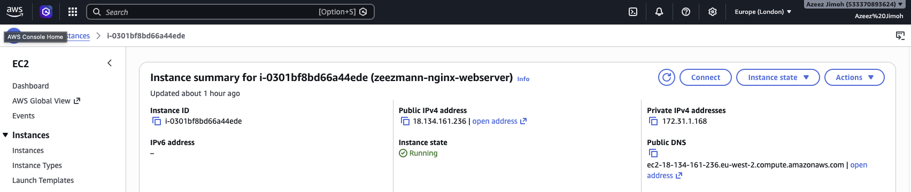
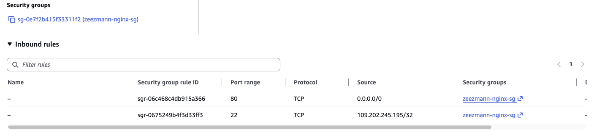
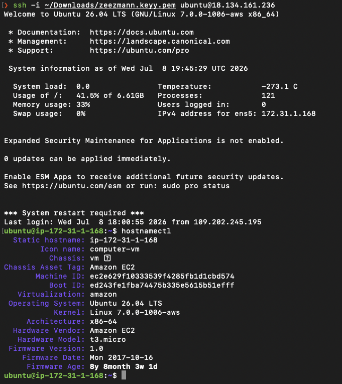
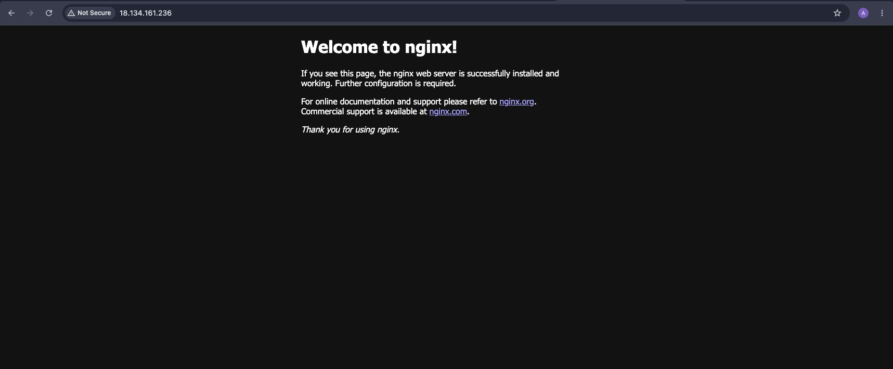
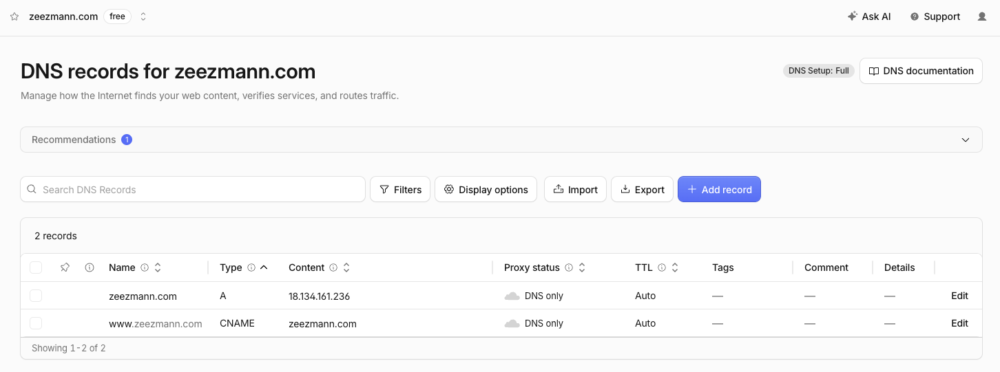
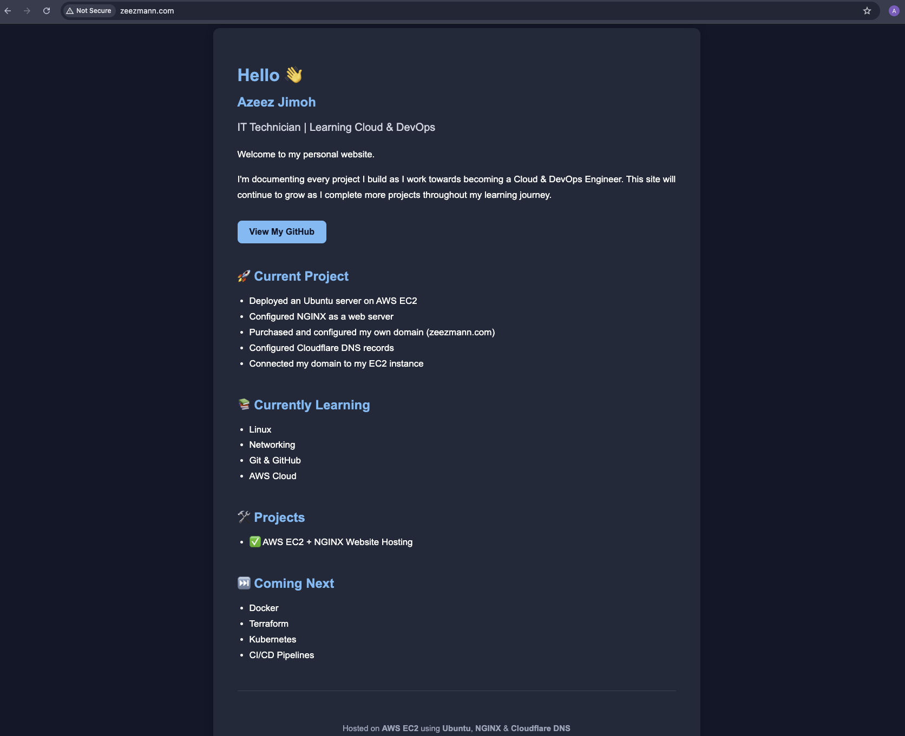

# 04 - Networking

# AWS EC2 + Cloudflare DNS + NGINX Project

This module helped me build a solid foundation in computer networking and understand how devices communicate across local networks and the internet.

Rather than only learning the theory, I applied these concepts by deploying my own Ubuntu server in AWS, configuring a web server with NGINX, registering my own domain (`zeezmann.com`), configuring Cloudflare DNS, and successfully hosting my first website on the internet.

---

# What I Learned

During this module, I gained both theoretical knowledge and practical experience with:

- DNS and domain name resolution
- DNS Records (A, AAAA, CNAME, MX, TXT and NS)
- DNS hierarchy
- Recursive DNS resolution
- The `/etc/hosts` file
- Routing
- Default Gateways
- Static vs Dynamic Routing
- CIDR notation
- Subnetting
- Subnet Masks
- DHCP
- The DHCP DORA process
- NAT (Network Address Translation)
- Cloud Networking using AWS

---

# Technologies Used

| Technology | Purpose |
|------------|---------|
| AWS EC2 | Virtual server hosting my website |
| Ubuntu 26.04 LTS | Linux operating system |
| NGINX | Web server |
| Cloudflare | Domain registration and DNS hosting |
| SSH | Secure remote administration |
| Git | Version control |
| GitHub | Project documentation and portfolio |
| DNS | Domain name resolution |
| HTTP | Serving web traffic |

---

# Project Architecture

```
                    Internet
                        │
                        ▼
                 zeezmann.com
                        │
                 Cloudflare DNS
                        │
                  A Record (IPv4)
                        │
                        ▼
             AWS EC2 Ubuntu Server
                        │
                     NGINX
                        │
                        ▼
                 Personal Website
```

---

# Project Walkthrough

The following sections document the complete process I followed, from purchasing a domain to successfully hosting a live website on AWS.

---

## 1. Registered My Domain

I registered my own domain, **zeezmann.com**, using Cloudflare.

This domain will be used throughout my Cloud & DevOps learning journey as I continue building projects.

---

## 2. Created an AWS EC2 Instance

I launched an Ubuntu 26.04 EC2 instance in the AWS London (`eu-west-2`) region.

I configured a Security Group to allow:

- SSH (TCP Port 22)
- HTTP (TCP Port 80)

### EC2 Instance



### Security Group Configuration



---

## 3. Established a Secure SSH Connection

Using an ED25519 SSH key pair, I securely connected from my MacBook to my EC2 instance.

Command used:

```bash
ssh -i ~/Downloads/zeezmann.keyy.pem ubuntu@<public-ip>
```

### SSH Session



---

## 4. Installed and Configured NGINX

After connecting to the server, I updated Ubuntu and installed NGINX.

```bash
sudo apt update
sudo apt upgrade -y
sudo apt install nginx -y
sudo systemctl enable nginx
sudo systemctl start nginx
```

Once installation was complete, browsing to the EC2 Public IP displayed the default NGINX welcome page.

### Default NGINX Page



---

## 5. Configured Cloudflare DNS

To connect my domain to my EC2 instance, I configured the following DNS records in Cloudflare.

| Type | Name | Value |
|------|------|-------|
| A | @ | EC2 Public IPv4 Address |
| CNAME | www | zeezmann.com |

Once DNS propagation completed, both of the following addresses successfully loaded my website:

- http://zeezmann.com
- http://www.zeezmann.com

### Cloudflare DNS Configuration



---

## 6. Deployed My Custom Homepage

I replaced the default NGINX landing page with a simple HTML homepage introducing myself and documenting my Cloud & DevOps learning journey.

The website is now hosted on AWS EC2 and accessible through my own custom domain.

### Final Website



---

# Useful Commands

## DNS

```bash
dig zeezmann.com

dig www.zeezmann.com

dig google.com +trace

dig github.com +trace
```

## Linux

```bash
ip addr

ip route

cat /etc/hosts

cat /etc/resolv.conf
```

## NGINX

```bash
sudo systemctl start nginx

sudo systemctl status nginx

sudo systemctl reload nginx
```

---

# Troubleshooting

## SSH Connection Hanging

### Problem

My SSH connection hung after moving from my work network to my home network.

### Cause

The EC2 Security Group only allowed SSH connections from my work public IP address because I had originally selected **My IP** while creating the inbound rule while I was at work.

### Resolution

I updated the Security Group inbound rule to allow my current home public IP address when I got home.

SSH connectivity was immediately restored.

---

## www.zeezmann.com Not Working

### Problem

The root domain (`zeezmann.com`) worked correctly, but `www.zeezmann.com` did not.

### Cause

The Cloudflare CNAME record had been configured correctly, but DNS propagation had not yet completed.

### Resolution

I verified the DNS configuration using:

```bash
dig www.zeezmann.com

curl -I http://www.zeezmann.com
```

Once DNS propagation completed, the website became accessible using both the root domain and the `www` subdomain.

---

# Lessons Learned

This project significantly improved my understanding of networking because I was able to apply the concepts I had studied in a real cloud environment.

Some of my biggest takeaways were:

- Understanding how DNS translates domain names into IP addresses.
- Learning how Security Groups act as virtual firewalls.
- Configuring real DNS records using Cloudflare.
- Deploying my first Linux web server in AWS.
- Troubleshooting networking issues using `dig`, `curl` and SSH.
- Understanding how DNS propagation affects website availability.
- Appreciating how Linux, networking, cloud infrastructure and web services work together to deliver a website.

---

# Next Steps

The networking knowledge gained from this module will be used throughout the rest of my Cloud & DevOps learning journey.

The next topics I will be studying are:

- Docker
- AWS
- Terraform & IaC
- CI/CD Pipelines
- Kubernetes
- Projects
